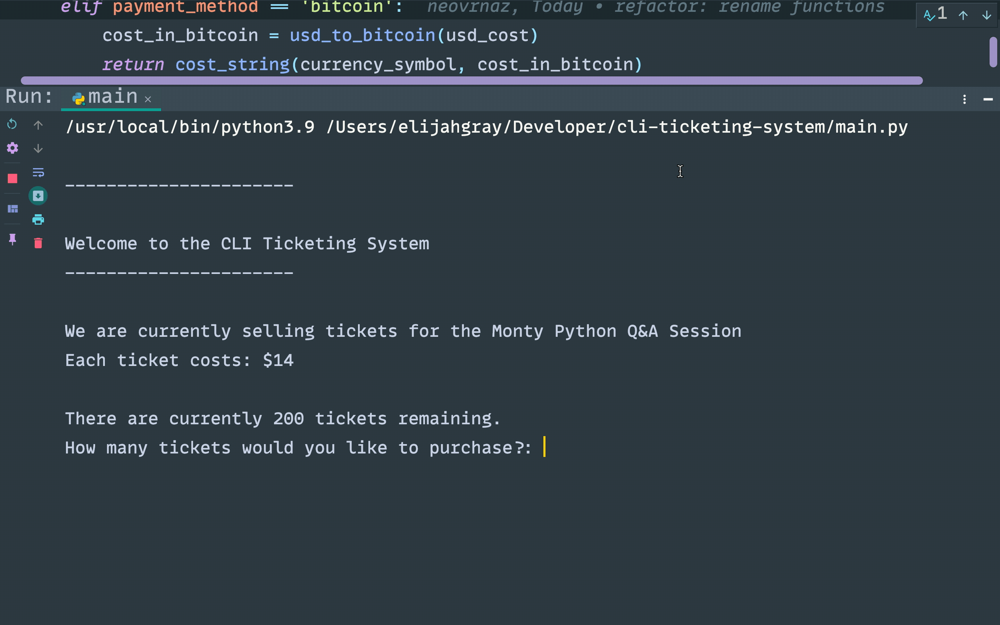

# cli-ticketing-system
> Purchase tickets to the Monty Python Q&A discussion



## Usage
Clone or download the project files and enter the command below to begin using the app:

```shell
python main.py
```
The comedy group Monty Python is having a Q&A discussion and this CLI app
intends to provide a gateway for ordering tickets into the session

This app allows users to:
* Order tickets to a fictional Q&A event
* Create and review their ticket order
* Pay in Bitcoin using the markets exchange rate (in real time)

## License:  [MIT](LICENSE)
